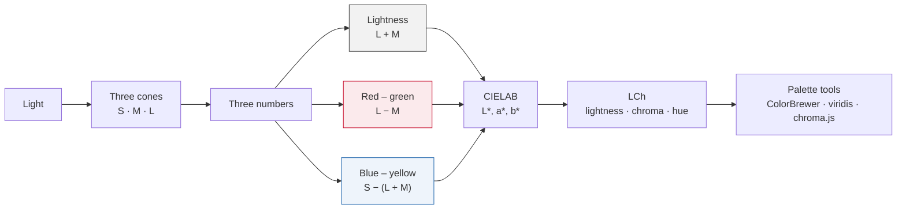
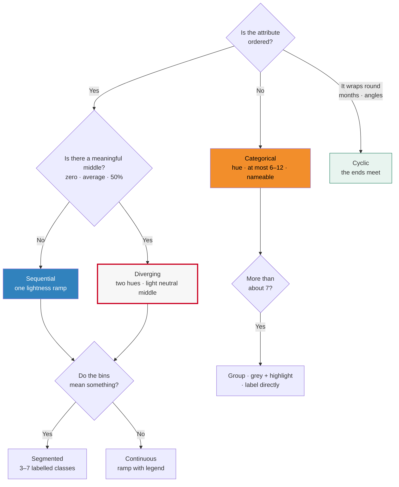

# Week 4 · The Power of Colour: lesson plan

A plan for the Week 4 lecture of LDSCI6253 Advanced Information Presentation & Visualisation, before anything is
built. It merges two decks:

- **Your 2025 Week 4 deck** (`01_Lecture_IPDV_4 2027.pdf`, 42 pages). Practice: the colour wheel, brand palettes,
  psychology, Datawrapper's "not ideal / better" pairs, and the tools.
- **Dimitris Mylonas's colour lecture** (`04_Lecture_IPDV_Colour.pdf`, 45 pages, written for LDSCI5209). Science:
  light, cones, opponent channels, CIELAB, appearance, naming, Munsell and colour maps.

The proposed lesson id is `ipdv-col`. It takes the same shape as Week 3 (`ipdv-da`): 90 minutes, the `northeastern`
theme, and lab-engine experiments in the focus layout. Facts from Munzner are checked against Chapter 10 of the copy
in the materials folder, with printed page numbers.

**Status:** plan only. Nothing is built yet. The decisions in §9 come first.

---

## 1. The journey in one line

> Students walk in thinking **colour makes a chart look nice**. They walk out able to explain why **colour decides
> what a chart says, what people see first, and who can read it at all.**

The idea under every stop: **colour is three channels, not one. Lightness says *how much*, hue says *which one*,
and your eye and brain bend both.** No colour science is assumed. Every idea arrives as an experience first (§3.3).

## 2. What carries over, so we don't repeat it

| Already taught | Where | Week 4 builds on it by… |
|---|---|---|
| Categorical, sequential and diverging tiles (`colour` preset), `check-colour` | Week 2 (`js/lessons.js:1843-1985`) | Recapping it in one slide, then explaining *why* (lightness orders, hue does not) and *how* (lightness profiles, midpoints, segmenting) |
| The dress poll, simultaneous-contrast and luminance images | Week 2 | Moving contrast **into a chart**: two cells with the same value that look different |
| Greyscale check (`accessibility` preset) | Week 2 | Adding colour-vision-deficiency (CVD) simulation and lightness profiles |
| "Week 4 is a whole lecture on colour" | Week 2, `:1846` | Quoting it on the reading slide (#2) as the promise kept |
| "Colour follows the ordering" (`scales`, deuteranopia) | Week 3 | Extending `scales` into Centrepiece 2 (§5, V8) |
| Attribute types N / O / Q | Week 3 | Giving each type its own kind of colour map |

## 3. The student journey

### 3.1 Six stops, one question each

The lesson is a route with six stops. At each stop, students carry one question and live through one experience
that answers it. Each stop **earns them one card**: a short reason why colour matters in charts. The cards pile up
on a "you are here" route slide at each boundary. At the end, the six cards together answer the lesson's question.

```mermaid
flowchart LR
  S0(["Walking in<br/>'colour makes it<br/>look nice'"]) --> S1["① Notice<br/>Does colour change<br/>what I see?"]
  S1 --> S2["② See<br/>Where does colour<br/>come from?"]
  S2 --> S3["③ Doubt<br/>Can I trust<br/>what I see?"]
  S3 --> S4["④ Encode<br/>How do I put<br/>data into colour?"]
  S4 --> S5["⑤ Mean<br/>What does<br/>colour say?"]
  S5 --> S6["⑥ Fix<br/>Can I do it<br/>myself?"]
  S6 --> A(["Arriving<br/>why colour matters<br/>so much in data vis"])
  style S0 fill:#f2f2f2,stroke:#999
  style S2 fill:#eef4fb,stroke:#08306b
  style S3 fill:#fdf0e6,stroke:#b35806
  style S4 fill:#e8f4ef,stroke:#1a7a5a
  style S5 fill:#fbeaec,stroke:#c8102e
  style A fill:#c8102e,color:#fff,stroke:#c8102e
```



| Stop | Min | The question they carry | What they live through | The "aha" | Card earned: why colour matters in charts |
|---|---|---|---|---|---|
| ① Notice | 0–8 | Does colour change what I see? | The mystery maps; the tiger in grey, then colour; the fruit in three versions | Without colour I can't tell *what* things are. Without lightness I can't tell *where* they are | **It's seen first.** Colour is noticed before anything is read, so it decides where eyes go |
| ② See | 8–23 | Where does colour come from? | Moving a wavelength across three cones; two lights making one yellow; failing to picture a reddish-green | Colour is made in my eyes and brain, in three channels | **It's made by eyes, not paint.** Lightness carries edges and detail, and about 1 in 12 men can't rely on red against green |
| ③ Doubt | 23–36 | Can I trust what I see? | Two identical squares that don't look it; a heatmap that misleads about two cells; naming one colour and disagreeing | The same colour looks different with different neighbours, light and words | **It's easily misread.** A chart's colours shift with their surroundings |
| ④ Encode | 36–60 | How do I put data into colour? | Ordering greys (easy) and hues (impossible); reading a value off a rainbow; seeing the rainbow's lightness hill | Lightness says how much. Hue says which one | **It can carry data, or distort it.** The wrong colour map tells a different story |
| ⑤ Mean | 60–70 | What does colour say? | Finding the story in a busy chart, then in a grey one with one red line; asking what red means, and to whom | Rare colour points the way. Familiar colour carries meaning, and the meaning is learned | **It carries meaning.** Colour tells people what to look at and what to make of it |
| ⑥ Fix | 70–84 | Can I do it myself? | Prescribing colour for a broken chart, in pairs | Every colour choice can be checked and justified | **So every colour is a decision.** Prescribe it, check it, label it |
| Arriving | 84–90 | Why does colour matter so much? | Solving the mystery maps; the before and after word clouds | — | All six cards, read as one sentence |

### 3.2 Bookends that prove the journey happened

1. **Before and after word clouds.** At minute 2 (#3), ask *"What is colour for in a chart?"* Expect *pretty,
   attractive, brand, highlight*. At minute 87 (#46), ask again and put the two clouds side by side: *"This is your
   journey."* Expect *order, categories, attention, meaning, misleading, accessible*. It is cheap, it uses the
   existing word cloud, and it is evidence of learning you can screenshot.
2. **The mystery maps.** At minute 3 (#4), show the same rainfall twice: once in a rainbow (jet) and once in viridis,
   each with four lettered regions. Ask *"Where should the flood team go first?"* The class's answers differ between
   the maps. Don't explain why yet. The thread comes back three times:
   - at #30, students read a value off each map and *measure* the difference;
   - at #31, the lightness profile *explains* it;
   - at #44, *they* explain it, in one sentence, with what they've learnt.
3. **The route slide** (#8, #15, #25, #35, #40) shows the six stops. Finished stops show the card they earned, and
   the next stop shows its question. Klee's quote rides on the stop ② slide and Albers's on stop ③.

### 3.3 Words arrive after the experience

Each term is introduced only *after* students have experienced the thing it names: the experience, then the word,
then its use in a chart.

| Stop | Experience first | Then the word |
|---|---|---|
| ① Notice | The tiger in grey and in colour; the fruit in three versions | Plain words only: light, dark, colour |
| ② See | A wavelength moving across three cones; two lights, one yellow; "no reddish-green" | wavelength, cone, colour vision deficiency, opponent channel, lightness / chroma / hue, CIELAB, *trichromacy*, *metamer* |
| ③ Doubt | Identical squares; the cubes; naming two discs | simultaneous contrast, colour constancy, basic colour terms, categorical perception |
| ④ Encode | Ordering swatches; reading the rainbow map | magnitude vs identity channel; categorical, sequential, diverging and cyclic; segmented vs continuous; perceptually uniform; lightness profile |
| ⑤ Mean | The busy chart vs the grey one | pre-attentive, highlight, convention, house palette |
| ⑥ Fix | Diagnosing a broken chart | colour prescription |

Terms in italics are optional: say them once and don't test them.

### 3.4 What makes it creative and dynamic

1. **The class is the experiment.** Mylonas's research runs colour experiments online. Here the room runs them on
   their phones: naming a colour, ordering swatches, reading a value off a rainbow, spotting the odd square. Their
   answers become the evidence on the wall. Hue ordering *fails live*, as Munzner's Figure 10.5 predicts.
2. **The deck practises what it teaches.** Slides are grey plus Northeastern red (`#c8102e`), so the only other
   colours on screen are the ones being studied. Say so at the start of stop ④.
3. **Every centrepiece runs predict → observe → explain → apply**, the standard set in Week 3's second review.
4. **One repeatable tool to leave with:** the five-question *colour prescription* (stop ⑥). It is also the seed for
   the Lab 4 rubric.

### 3.5 Budget

About 49 slides: 6 experiment slides (3 of them centrepieces), 11 game slides, 5 word clouds, 5 route slides and one
timed activity. That is lighter than Week 3 (56 slides, 13 experiments, 7 games). The timings add up to exactly 90
minutes, so questions go to the lab or after.

### 3.6 Learning outcomes (rewritten from 2025 p5)

By the end, students can:

1. **Explain** how light becomes three cone signals and then three opponent channels, and why that makes red–green
   the riskiest pair.
2. **Predict** when colour will mislead: contrast with neighbours, lighting and 3D shading, and naming boundaries.
3. **Match** a colour map to a data type, using Munzner's split: luminance and saturation are magnitude channels;
   hue is an identity channel.
4. **Diagnose** colour faults in a published chart: rainbows, too many hues, red–green, no-data ambiguity, colour
   that encodes nothing.
5. **Prescribe and justify** an accessible palette that passes CVD simulation, the greyscale test and the
   "can you name it?" test.

The evidence is the two word clouds (#3 and #46), the explanation of the mystery at #44, and the prescriptions sent
at #42.

---

## 4. Running order (90 minutes)

**Route** says how each slide gets built: an existing slide type, an existing experiment, or something new (§6).
**Bold** marks a centrepiece; *(opt)* is the first thing to cut.

### ① Notice: does colour change what I see? (0–8)

| # | Slide | Route | What happens | Min |
|---|---|---|---|---|
| 1 | Week 4 · The Power of Colour | `title` | The lesson's question underneath: *Why does colour matter so much in data vis?* | 0.5 |
| 2 | Reminder and reading | `content` | Quote Week 2: "Week 4 is a whole lecture on colour". Fix the reading first (§9, D1) | 0.5 |
| 3 | Before · What is colour for in a chart? | `wordcloud`, focus | The "before" snapshot. Leave it alone; it comes back at #46 | 1 |
| 4 | The mystery · Same rainfall, two maps | `game`, `choice`, 2 questions, `voteOnly`, regions lettered A–D | "Where should the flood team go first?", first on the jet map, then on viridis. The answers differ. *"Hold that thought. You'll explain it at the end."* | 1.5 |
| 5 | Name the danger | `gallery`, 2 layers (Mylonas p5 → p6) | The tiger in grey, then in colour. Flip side: *to a deer, a dichromat, this orange tiger looks green* (Fennell et al. 2019). Plants the CVD idea | 1 |
| 6 | Predict · Which fruit picture is hardest to read? | `game`, `choice`, image band | One picture holds the three versions (Mylonas p7–9: grey, colour only, full), lettered A / B / C. Most pick the grey one | 1 |
| 7 | Name the fruits | `gallery`, 3 layers with captions | Reveal one at a time. The surprise: **colour-only (B) is hardest**, because no lightness means no edges. Caption: ***Lightness shows where. Hue shows what.*** | 2.5 |

### ② See: where does colour come from? (8–23)

| # | Slide | Route | What happens | Min |
|---|---|---|---|---|
| 8 | Route · You are here | `journey`, six stops (§3.1) | Card ① earned: *It's seen first.* Next question: *Where does colour come from?* Klee (Mylonas p3): "Colour is the place where our brain and the universe meet" | 0.5 |
| 9 | Colour isn't in the light | `image` (Mylonas p12) | The spectrum zooms to the 380–700 nm slice. Wavelength is physics; colour is what your brain makes of it | 1 |
| 10 | 120 million rods, 6 million cones | `keyfact` (Mylonas p13) | Cones cluster at the centre of gaze, so small coloured marks are harder to read (Munzner p224) | 1 |
| 11 | **Three numbers** | **`experiment`, new kind `cones`** (V1) | **Centrepiece 1.** A wavelength becomes three cone responses. Two different lights give the same three numbers. Your screen only has three lights | 6 |
| 12 | When one cone shifts | `experiment`, `cones`, deutan states (V3) | The M curve slides towards L, so red and green give nearly the same numbers. About 8% of men and 0.5% of women (Munzner p235). The deer callback | 3 |
| 13 | Check · Which colour can't you picture? | `game`, `choice` | Reddish-yellow, bluish-red, reddish-green or yellowish-green. The class finds there's no reddish-green: opponent channels, from their own heads | 1 |
| 14 | Three channels | `experiment`, `cones` `mode: 'opponent'` (V2) | The cones combine into lightness, red–green and blue–yellow; those axes become CIELAB, then LCh. Mylonas p17–19 on the flip | 2.5 |

### ③ Doubt: can I trust what I see? (23–36)

| # | Slide | Route | What happens | Min |
|---|---|---|---|---|
| 15 | Route · You are here | `journey` | Card ② earned: *It's made by eyes, not paint.* Next question: *Can I trust what I see?* Albers: "…it deceives continually" | 0.5 |
| 16 | Check · Which inner square is darker? | `game`, `choice`, image (Mylonas p21) | Left, right or the same? They're the same. Twenty seconds, because Week 2 showed the effect | 1 |
| 17 | Same value, different colour | `experiment`, new kind `contrast` (V4) | Albers squares, then the bridge reveal (p22), then **a heatmap with two cells of the same value that look different**, then the fix | 3.5 |
| 18 | The brain corrects for the light | `gallery`, 2 layers (Mylonas p25 → p26) | The cubes illusion with the bridge reveal. Callback: *"Remember the dress?"* Shading in 3D charts changes the colours people see | 2 |
| 19 | Lilac chaser *(opt)* | `image` (p23) | Afterimages are tired opponent channels. Large saturated areas tire the eye, so use pastels for big areas (Munzner p224). Motion caution (§8) | 1.5 |
| 20 | Name this colour ① | `image` + `wordcloud` | A yellow disc. The cloud says *yellow*, almost unanimously | 1 |
| 21 | Name this colour ② | `image` + `wordcloud` | A dusty pink disc. The cloud scatters: *pink, salmon, rose, peach, mauve…* | 1 |
| 22 | Eleven basic words | `split` (Mylonas p30–31) | Berlin & Kay's hierarchy, and Mylonas's online naming experiment: *"You just ran it."* | 1 |
| 23 | Quick · Spot the odd square | `game`, `choice`, 2 questions, `timeLimit` about 5 s (V5) | Two rings of lettered squares (Mylonas p33). In one ring the odd square **crosses** blue/green; in the other it stays **within** blue. Fewer find it in time when it stays within | 2 |
| 24 | Names shape seeing | `image`, framed with flip | Wakui, Mylonas, Caparos & Davidoff (2025); Russian blues (Winawer et al. 2007). Rule: **use colours people can name** (Munzner p226: "easily nameable colors are desirable") | 1 |

### ④ Encode: how do I put data into colour? (36–60)

| # | Slide | Route | What happens | Min |
|---|---|---|---|---|
| 25 | Route · You are here | `journey` | Card ③ earned: *It's easily misread.* Next question: *How do I put data into colour?* Point out that the deck is grey plus one red, and why | 0.5 |
| 26 | Put them in order | `game`, `order`, 3 questions (V6) | Five greys, then five saturations, then five hues, each lettered A–E. Greys and saturations agree; **hues scatter** | 3 |
| 27 | Lightness says how much. Hue says which one. | `cards`, rows, progressive | Munzner p223–224: luminance gives fewer than 5 steps on a mixed background; saturation about 3; hue 6–7 for small separated marks. Callback to the fruit | 1.5 |
| 28 | Three maps for three data types | `journey` (the decision tree in §5, V7) | Recap Week 2's types, then add the midpoint question and segmented vs continuous | 1.5 |
| 29 | Check · Which colour map? | `game`, `choice`, 5 questions | Profit/loss by quarter, satisfaction 1–10, Remain / Leave / Undecided, population density, months. Two are deliberately arguable (§7, C9) | 3 |
| 30 | Read the map ① and ② | `game`, `slider`, 2 questions | **The mystery maps again, now to measure.** Read the value at X, first in jet, then in viridis. Answers spread wider on jet | 2.5 |
| 31 | **Anatomy of a rainbow** | **`experiment`, `scales` extended** (V8) | **Centrepiece 2, which explains the mystery.** Each scale's lightness profile: jet is a hill (L\* 13 → 97 → 25); viridis is a ramp (15 → 91). Then greyscale, the equal-steps test, deuteranopia and the fix | 5 |
| 32 | **Who can read your chart?** | **`experiment`, new kind `palette`** (V9) | **Centrepiece 3.** 4 categories, then 12, then small dots vs big bars, then deuteranopia, then greyscale, then grey plus one accent with direct labels | 4 |
| 33 | Agree or disagree? | `game`, `truefalse` (2025 p30–34) | "Datawrapper says the right-hand version is better." Use the bars and the US map pairs; the Likert and treemap pairs are *(opt)* | 2 |
| 34 | Five tools, and Altair on the back | `image`, framed with flip | ColorBrewer, Colorgorical, Heer & Stone's palette analyser, chroma.js and Adobe Color. The back has the four Altair lines in §6.4 | 1 |

### ⑤ Mean: what does colour say? (60–70)

| # | Slide | Route | What happens | Min |
|---|---|---|---|---|
| 35 | Route · You are here | `journey` | Card ④ earned: *It can carry data, or distort it.* Next question: *What does colour say?* | 0.5 |
| 36 | Quick · Which network rose fastest? | `game`, `choice`, 2 questions, `timeLimit` about 5 s | First every line in colour, then every line grey except Netflix in red (2025 p22). The reveal shows the 2025 p11 pairs: **rare is loud**. Cites Healey & Enns (2012) for "under about 200 ms", fixing 2025 p16 | 2.5 |
| 37 | The painter's wheel vs your eye | `gallery`, 2 layers (2025 p9–10, then Mylonas p17) | Harmony is a taste rule; the channels are a perception rule. The painter's "complementary red–green" is exactly the CVD pair. Analogous and monochromatic schemes make good sequential ramps. When the rules disagree, perception wins | 2 |
| 38 | House palettes | `image`, framed (2025 p20–21, p24) | The NYT is flexible; the FT and The Economist stick to their brand. Mention the GLA City Intelligence guidelines. The same colour means the same thing in every chart | 1.5 |
| 39 | What does red mean? | `wordcloud`, then `cards` | Then reveal: red is Labour in London and Republican in Washington, and Chinese stock screens show rises in red. **Meaning is learned, so say it in the legend.** This replaces the pop-psychology infographic (2025 p27; §7, C13) | 3.5 |

### ⑥ Fix: can I do it myself? (70–84)

| # | Slide | Route | What happens | Min |
|---|---|---|---|---|
| 40 | Route · You are here | `journey` | Card ⑤ earned: *It carries meaning.* Next question: *Can I do it myself?* | 0.5 |
| 41 | The colour prescription | `journey`, `stepper`, 5 stops | Five questions: (1) What type is the coloured attribute? (2) Which map type? (3) How many classes, and why? (4) Which palette: name or hex? (5) Which checks does it pass: CVD, greyscale, nameable, labelled? | 1 |
| 42 | Makeover studio | `keywords` + `activity: 'think-pair-share'`, stages *Diagnose · 2 min* / *Prescribe · 4 min* / *Share · 3 min* `[send]`, `timeLimit` | A jigsaw by seat: A, the ancestry map (2025 p6); B, the profitable markets map (p7); C, "fly the nest" (p8). Pairs send their prescription as text | 9 |
| 43 | Before and after | `gallery`, 6 layers | Two student prescriptions, then the redrawn version (§6.3) | 3.5 |

### Arriving: why does colour matter so much? (84–90)

| # | Slide | Route | What happens | Min |
|---|---|---|---|---|
| 44 | The mystery, solved | `game`, `choice`; the explanation shows jet's lightness hill | Back to #4's maps: "Why did the rainbow send the team somewhere else?" Options: yellow is the rainbow's lightest colour, so it looks like the most rain / hue has no order / both / it didn't. The answer is both. Ask one student to say it in their own words | 2 |
| 45 | Why colour matters so much | `journey`, 6 stops, progressive | The five earned cards return one by one, and card ⑥ arrives last: *So every colour is a decision.* Read them as one sentence: colour is seen first, made by eyes, easily misread, can carry data or distort it, and carries meaning, so every colour is a decision | 1.5 |
| 46 | After · What is colour for in a chart? | `image` of #3's cloud + `wordcloud` rail | *"This is your journey."* (§6.1 says how to show both) | 1.5 |
| 47 | Next: Lab 4 | `content` | Fixes 2025 p42, which said "Lab 1". Preview in §6.5 | 0.5 |
| 48–49 | References | `content` | §10 | 0.5 |

---

## 5. Breaking the hard ideas down visually

Each card below is one dominant visual. Each step is one click with one takeaway caption, in the focus layout.
**Predict** is the prompt shown over the visual before the first step.

### V1 · Light becomes three numbers (Centrepiece 1, slide 11)

- **Hard idea:** trichromacy and metamers.
- **Misconception:** "Each colour is a wavelength."
- **Picture:** the spectrum runs along the bottom. The S, M and L sensitivity curves sit above it (Stockman & Sharpe
  2000, peaks near 440, 540 and 565 nm). A vertical wavelength line crosses them. Three bars on the right fill to
  where the line cuts each curve, with a swatch above the bars.
- **Predict:** *"Light at 580 nm. Which cone answers most?"*

| Step | On screen | Caption |
|---|---|---|
| 1 | The spectrum and three curves | Three kinds of cone, three overlapping ranges |
| 2 | The line at 450 nm | Blue light: mostly S |
| 3 | The line at 580 nm | Yellow: L and M together, almost no S |
| 4 | The line at 620 nm | Red: L leads M |
| 5 | Two lines, 540 + 630 nm, mixed | **Two lights, the same three numbers, the same yellow** |
| 6 | Zoom into phone sub-pixels | Your screen has three lights. That's all it needs |

- **Explain:** you don't see wavelengths; you see three numbers. RGB is how screens *make* colour, not how you see it
  (Munzner p220).
- **Apply:** feeds V3 (shift one curve) and V2 (combine the numbers).

### V2 · Three numbers become three channels (slide 14)



- **Picture:** the three cone bars from V1 feed three bipolar sliders (black–white, red–green, blue–yellow). The
  sliders rotate into the CIELAB sphere (Mylonas p19, left), then unwrap into the LCh cylinder.
- **Steps:** (1) the cones; (2) add them, which gives lightness; (3) subtract L − M, which gives red–green;
  (4) subtract S − (L + M), which gives blue–yellow; (5) the three axes become L\*, a\*, b\*; (6) the polar form is
  lightness, chroma and hue angle.
- **Explain:** a\* and b\* *are* the opponent channels. That is why CIELAB is "perceptual" and why palette tools
  work in it. Slide 13's "no reddish-green" is the proof the class just produced.
- **Why it matters for charts:** CVD removes one channel, red–green. Lightness is the channel that carries edges and
  detail (Munzner p220, p223).

### V3 · Colour vision deficiency, from the cones up (slide 12)

- **Picture:** the V1 curves again.
- **Steps:** (1) normal vision; (2) the M curve drifts towards L (deuteranomaly); (3) the M curve is gone
  (deuteranopia); (4) a red–green chart through the Machado (2009) simulation collapses; (5) the same chart in
  blue–orange survives.
- **Numbers:** about 8% of men and 0.5% of women (Munzner p235); rates are highest in populations of Northern
  European descent. The confusions are not only red/green: also red/black, blue/purple, light green/white and brown/green (Munzner p235).
- **Picture for the flip:** the 2025 p15 parrots in four vision types.
- **Tone:** never ask anyone to identify themselves. The simulation lets everyone see it.

### V4 · Same value, different colour (slide 17)

- **Steps:** (1) Albers squares (Mylonas p21); (2) a bridge joins the two inner squares, so they are visibly the
  same (p22); (3) a 6×6 sequential heatmap where cells *P* and *Q* hold the same value but sit among dark and light
  neighbours, and *P* looks lighter; (4) the fix: print the value in the cell, use fewer steps, add a thin cell border.
- **Explain:** our accuracy at judging the luminance of non-adjacent regions is low. Munzner (p223) says fewer than
  five steps on a non-uniform background, and Ware avoids grey for more than 2–4 bins.
- **Apply:** this is the fault in makeover chart B, whose pale bins sit on a patterned sea.

### V5 · Names shape seeing (slides 20–24)

- **Picture:** two word clouds side by side, the yellow disc (one word) and the dusty pink disc (a scatter).
- **Then:** Berlin & Kay's staircase (white/black → red → green/yellow → blue → brown → purple/pink/orange/grey).
- **Then the timed game:** the cross-boundary odd square is found faster than the within-category one. That is a
  live replication of Wakui et al. (2025) and Winawer et al. (2007).
- **Rule:** for categories, choose colours the audience can name. *"The red line"* survives a meeting; *"the
  dusty-pink line"* doesn't. Heer & Stone's palette analyser (Mylonas p43) scores exactly this.

### V6 · Lightness orders, hue doesn't (slide 26)

- **Picture:** three rows of five lettered swatches (Mylonas p34), one row per question.
- **Live result:** the order reveal for greys and saturations is near-unanimous. For hues it scatters, apart from a
  cluster of people who give the rainbow (ROYGBV), which is a *learned convention, not perception* (Munzner p224).
- **The hue row has a second lesson:** full-strength hues are not equally light. CIELAB L\* computed from sRGB:

  | Red | Yellow | Green | Cyan | Blue | Magenta |
  |---|---|---|---|---|---|
  | 53 | **97** | 88 | 91 | **32** | 60 |

  So a hue ramp also carries an accidental lightness ramp, and yellow always shouts. This sets up V8.

### V7 · Choosing a colour map (slide 28)



On the slide, the tree is a `journey` with one stop per click. It mirrors Munzner's Figure 10.6 (after Brewer):
colour maps follow data types. Bivariate maps get a single line: safe only when one of the two attributes has two
levels (Munzner p234–235).

### V8 · Anatomy of a rainbow (Centrepiece 2, slide 31)

- **Predict:** the mystery vote (#4) and the slider (#30) are the predictions. *"The two maps sent you to different
  places. Why?"*
- **Picture:** the `scales` heatmap with **a lightness profile strip under the legend**, plotting L\* along the
  ramp. The profile is the new visual; nothing in SlideForge shows it yet.

| Step | On screen | Caption |
|---|---|---|
| 1 | Data in jet | Bright bands look like features |
| 2 | Jet's L\* profile: 13 → 32 → 54 → 91 → 91 → **97** → 67 → 53 → 25 | **A hill, not a ramp.** The brightest band sits mid-scale, and both ends are dark |
| 3 | Greyscale view | Low and high look alike; the middle "wins" |
| 4 | Equal-steps test: two ranges of the same width, one in cyan–green–yellow and one in yellow | Three colours in one range, one colour in the other (Munzner Fig. 10.12) |
| 5 | Deuteranopia (Machado 2009) | The red end and the green middle close up |
| 6 | Viridis, with profile 15 → 36 → 55 → 73 → 91 | A steady climb: order you can see, even in grey |
| 7 | Segmented with labelled classes | When bands should be named, bin them deliberately (Munzner p234) |

- **Explain:** Munzner names three problems (p232). Hue is used for order; equal steps don't look equal; hue can't
  show fine detail. The rainbow's one virtue is nameable sub-ranges.
- **Apply:** makeover chart C is a rainbow on ordered bins.
- **For reference**, the other profiles: ColorBrewer Blues 96 → 35 (monotonic); RdBu 42 → 75 → **97** → 77 → 46 (a
  clean V, light in the middle).

### V9 · Who can read your chart? (Centrepiece 3, slide 32)

| Step | On screen | Caption |
|---|---|---|
| 1 | A scatter with 4 categories, Tableau 10 | Four hues: easy |
| 2 | The same with 12 categories | Past about 7, identity breaks (Munzner p224, p226) |
| 3 | The same palette on small dots and on big bars | Hue fades in small marks. Use saturated colour for small marks, pastels for big areas |
| 4 | Deuteranopia | Red and green pairs merge |
| 5 | Greyscale | The palette survives only where lightness differs |
| 6 | Grey everything, one accent, and labels beside the lines | **Fewer colours, different lightness, and a label beside each.** WCAG 1.4.1: don't rely on colour alone |

---

## 6. Build plan

### 6.1 Reuse or make, slide by slide

Checked against the code on 4 Oct 2026. Line references are in `js/render.js` unless another file is named.

**Key:**
- ✅ an existing SlideForge part, with words only
- 🖼 an existing part that needs a picture made (A-numbers, below)
- 🛠 needs new code (N-numbers, below)
- ⚠ the plan changed to fit what SlideForge can do

**Seven limits shaped the table:**

1. **Game pictures appear only on the wall.** Phones never get a question's image or its alt text (`js/live.js:2939-2981`, `server/server.js:1291-1302`). The lab draws only the Estimate picture (`lab/src/model/designs/formats.ts:70-83`). Every colour question is answered by looking up at the wall. (The Week 3 review says alt text reaches phones; it doesn't.)
2. **Beat the Clock (`speed`) won't do short timed picture questions.** It runs one clock for the whole round (30–600 s), and its self-paced sprint never shows the question on the wall (`src/model.js:1285-1289`, `js/live.js:1896-1930`). Slides #23 and #36 become `choice` questions with a per-question `timeLimit`.
3. **An `image` slide holds one picture.** A two- or three-picture reveal is `type: 'gallery'`, with `layers: [{image, caption, source}]` and `progressive: true` (`:1033-1065`). The lab shows up to 8 layers (`lab/src/model/layouts.ts:945-990`). The lab ignores picture cards.
4. **`compare` has no image field** (`:1935-1964`). Picture comparisons become galleries.
5. **The lab shows at most 4 cards** (the rest go into the notes) **and 6 journey stops** (`fromSlideForge.ts:259-272`, `layouts.ts:324`). The five-question prescription and the six earned cards become `journey` slides.
6. **A slide can't show an earlier slide's results.** The relay clears replies when a prompt opens or the slide changes (`server/server.js:2240-2266`, `:2357-2361`), and the host resets them when you go back. The before/after clouds need N8 or a manual screenshot.
7. **There is no swatch element** (`src/render/lattice.js:405`), and options are plain text. Every swatch is drawn into a picture with letters on it. SVG works as a file or as `data:image/svg+xml` (`src/deck/content.js:467-490`).

| # | Slide | What we use | What we make | |
|---|---|---|---|---|
| 1 | Title | `title` | — | ✅ |
| 2 | Reminder and reading | `content` | — | ✅ |
| 3 | Before cloud | `content` + `feedback: {kind:'wordcloud'}`, `presentAs: 'focus'` | Screenshot of the result, for #46 | ✅ |
| 4 | The mystery | `choice`, 2 questions, `image` per question, `voteOnly: true` so no answer is shown yet | A1 (regions version) | 🖼 |
| 5 | Name the danger | `gallery`, 2 layers, progressive; the deer line is layer 2's caption | A2 | 🖼 ⚠ |
| 6 | Predict: hardest fruit | `choice`, 1 question, `image` | A3 (the three versions side by side, lettered) | 🖼 |
| 7 | Name the fruits | `gallery`, 3 layers with captions | A3 (single versions) | 🖼 ⚠ |
| 8, 15, 25, 35, 40 | Route · You are here | `journey`, 6 stops, `progressive: false`. The quote goes in `subtitle`. In classic, `buildMode: 'dim'` dims finished stops | — (optional N7 for a marker in the lab) | ✅ |
| 9 | Colour isn't in the light | `image` + `body` (the flip) | A4 | 🖼 |
| 10 | Rods and cones | `keyfact`: `body` "6 million", `subtitle`, `bullets` | — | ✅ |
| 11 | **Three numbers** | `experiment`, per-slide `states` (≤ 8), focus layout | N2 kind `cones` | 🛠 |
| 12 | When one cone shifts | `experiment` `cones`, deutan states; parrots credited in `chartSource` | N2; A5 for the notes or handout | 🛠 |
| 13 | Which colour can't you picture? | `choice`, text options | — | ✅ |
| 14 | Three channels | `experiment` `cones`, opponent states | N2 | 🛠 |
| 16 | Which inner square is darker? | `choice` + `image` | A6 (Albers squares) | 🖼 |
| 17 | Same value, different colour | `experiment` | N4 kind `contrast`, *or* a fallback: `gallery` of A6 + A6b (bridge) + A6c (heatmap) + A6d (fix) | 🛠 / 🖼 |
| 18 | The brain corrects for the light | `gallery`, 2 layers | A7 | 🖼 ⚠ |
| 19 | Lilac chaser *(opt)* | `image` | A8 (an animated SVG; it runs as an image) | 🖼 |
| 20, 21 | Name this colour | `image` + `feedback: {kind:'wordcloud'}`, rail layout (keeps the disc visible) | A9 (two discs) | 🖼 |
| 22 | Eleven basic words | `split`: `image`, `bullets` | A10 | 🖼 |
| 23 | Spot the odd square | `choice`, 2 questions, `image` each, `timeLimit` about 5 s, `confidence: false` | A11 (cross and within rings, lettered) | 🖼 ⚠ |
| 24 | Names shape seeing | `image` + `body` (the flip) | A12 | 🖼 |
| 26 | Put them in order | `order`, 3 questions, items "A"–"E", `image` each. The reveal shows "N of M here" for each place and the most-swapped pair (`js/player.js:2271-2296`) | A13 (three lettered swatch rows) | 🖼 |
| 27 | Lightness says how much | `cards`, 3 cards, progressive | — | ✅ |
| 28 | Three maps, three data types | `journey`, `journeyMode: 'stepper'`, 5 stops | — | ✅ |
| 29 | Which colour map? | `choice`, 5 questions; `voteOnly` on the two arguable ones | — | ✅ |
| 30 | Read the map | `slider`, 2 questions, `image` each. The reveal plots every answer on the line (`js/player.js:2167-2207`) | A1 (point X version) | 🖼 |
| 31 | **Anatomy of a rainbow** | `experiment` `scales`, per-slide `states` | N1: extend `scales` | 🛠 |
| 32 | **Who can read your chart?** | `experiment` | N3 kind `palette` | 🛠 |
| 33 | Agree or disagree? | `truefalse`, an `image` per statement | A16 | 🖼 |
| 34 | Five tools, Altair on the back | `image` + `body` (the Altair lines) | A17 (tools in one picture) | 🖼 |
| 36 | Which network rose fastest? | `choice`, 2 questions, `timeLimit` about 5 s, `image` each; "rare is loud" in `explanation` | A18 (coloured and grey-plus-red line charts) | 🖼 ⚠ |
| 37 | The painter's wheel vs your eye | `gallery`, 2 layers: the painter's wheel, then the opponent channels | A20 | 🖼 ⚠ |
| 38 | House palettes | `image` + `body` | A21 | 🖼 |
| 39 | What does red mean? | `content` + `wordcloud` rail, then `cards` (≤ 4) | — | ✅ |
| 41 | The colour prescription | `journey`, `journeyMode: 'stepper'`, 5 stops (cards would lose the fifth question in the lab) | — | ✅ ⚠ |
| 42 | Makeover studio | `type: 'keywords'`, `activity: 'think-pair-share'`, `activityPresentation: 'stages'`, bullets `"Diagnose · 2 min\t…"`, `"Prescribe · 4 min\t…"`, `"Share · 3 min [send]\t…"` (`src/activities/stages.js:104-133`). Sent texts land in the idea box, and up to 3 can be spotlit on the wall (`js/live.js:611-619`) | A22 (the three charts) on Canvas or printed cards, because the stage track fills the wall and phones get no pictures. The A/B/C split is written into the brief; SlideForge can't assign groups | 🖼 ⚠ |
| 43 | Before and after | `gallery`, 6 layers (before, then after, for A, B and C) | A22b (three "after" charts, drawn in Altair) | 🖼 ⚠ |
| 44 | The mystery, solved | `choice` + `image`; `explanation` names the lightness hill | A23 (the jet hill picture) | 🖼 |
| 45 | Why colour matters so much | `journey`, 6 stops, progressive, one earned card per stop (cards would lose two in the lab) | — | ✅ ⚠ |
| 46 | After cloud | `image` (the #3 screenshot) + `wordcloud` in the rail: the before picture beside the after cloud | N8, *or* the screenshot inserted during the lesson | 🖼 ⚠ |
| 47–49 | Lab 4, references | `content` | — | ✅ |

**Tally:**
- 19 slides need words only.
- 24 need a picture (A1–A23).
- 6 need new engine code: 4 kinds or extensions, N1–N4. #17 can fall back to pictures.
- 11 changed from the earlier plan to fit SlideForge.

That makes 49 slides.

**Pictures to make.** "Extract" means pulling the image out of the PDFs with pypdf (tested: 52 images from the Mylonas deck, 84 from the 2025 deck). "Tool" means drawing it in `tools/build-colour-images.mjs`, using the `tools/build-perception-images.mjs` pattern and writing SVG unless noted.

| A | For | Source | How |
|---|---|---|---|
| A1 | #4, #30 | A new rainfall field | Tool: jet and viridis maps, each in a regions-A–D version and a point-X version, with a 0–100 mm legend (4 SVGs) |
| A2 | #5 | Mylonas p5, p6 | Extract |
| A3 | #6, #7 | Mylonas p7–9 | Extract three; tool to compose the lettered A/B/C strip |
| A4 | #9 | Mylonas p12 | Extract |
| A5 | #12 notes | 2025 p15 | Extract |
| A6–A6d | #16, #17 | Mylonas p21–22 (vector, so it can't be extracted) | Tool: Albers squares, bridge, heatmap with P and Q, the fix |
| A7 | #18 | Mylonas p25, p26 | Extract |
| A8 | #19 | Hinton (2005) | Tool: an animated SVG, plus a still frame for reduced motion |
| A9 | #20, #21 | — | Tool: a yellow disc and a dusty pink disc on mid-grey |
| A10 | #22 | Mylonas p30–31 | Extract |
| A11 | #23 | After Mylonas p33 | Tool: two rings of 12 squares, lettered, with one odd square (cross-boundary and within-category) |
| A12 | #24 | Mylonas p33 | Extract, credited, after asking (D3) |
| A13 | #26 | After Mylonas p34 | Tool: three rows of five swatches (greys, saturations, hues), shuffled and lettered A–E |
| A16 | #33 | 2025 p30–34 | Extract |
| A17 | #34 | 2025 p37–40, Mylonas p41–43 | Extract, then the tool composes a 2×3 grid |
| A18 | #36 | 2025 p22 (Netflix vs HBO) | Tool: two line charts. Check the nominations data against the source first |
| A20 | #37 | 2025 p9, Mylonas p17 | Extract |
| A21 | #38 | 2025 p20–21, p24 | Extract |
| A22 | #42, #43 | 2025 p6–8 | Extract; also a Canvas page or printed cards |
| A22b | #43 | §6.3 | Altair, exported to SVG; this is also Lab 4 starter code |
| A23 | #44 | The N1 profile | Tool: jet ramp with its L\* hill |

**Code to write.**

| N | What | Touches | Needed for |
|---|---|---|---|
| N1 | **Extend `scales`**: `scheme: 'jet' \| 'viridis'`, `cvd: 'protan' \| 'tritan'`, a greyscale view, an L\* profile strip under the legend, an equal-steps band, and segmented classes | `lab/src/engine/experimentKinds.ts` `colourOf`/`seen` (`:604-620`) and the `KState` fields; sRGB → L\* lifted from `lab/src/model/combos.ts:47-57`; `npm run build`; tests | #31 (centrepiece) |
| N2 | **New kind `cones`**: S/M/L curves, a wavelength line, three bars, a metamer pair, the RGB screen, deutan shift and loss, then opponent channels → CIELAB → LCh | `experimentKinds.ts`: `KINDS` (`:50`), `KIND_GLYPHS` (`:53`), a `kindPicture` branch (`:152`), `KIND_PRESETS` (`:739`); editor fields in `src/render/experiments.js:253-272`; the Stockman & Sharpe table | #11 (centrepiece), #12, #14 |
| N3 | **New kind `palette`**: N categories, dots vs bars, deuteranopia, greyscale, grey plus an accent with labels | Same files as N2; reuses the Machado matrix and the greyscale code from N1 | #32 (centrepiece) |
| N4 | **New kind `contrast`** *(optional)*: the A6 sequence drawn live | Same files as N2 | #17; A6–A6d cover it |
| N5 | `tools/build-colour-images.mjs` | New file | A1, A3, A6, A8, A9, A11, A13, A17, A18, A23 |
| N6 | `tools/build-ipdv-week4.js` and `tests/week4.test.js` | New files, copying Week 3's | Bundle and tests (§6.6) |
| N7 | *(Optional)* The lab honours `buildMode: 'dim'` on `journey`, marking "you are here" | `lab/src/model/fromSlideForge.ts:235-246` | The route slides in the lab |
| N8 | *(Recommended)* A feedback slide can show an earlier slide's results. The replies are already journalled (`server/server.js:2818`, `server/sessions.js:153`) | Relay, `js/live.js`, the feedback renderer | #46, the before/after bookend |

No new game style, phone input kind or activity is needed. Two styles behave differently in rehearsal (`js/demo.js`): Estimate shows answer chips instead of dots on the line, and Beat the Clock can't be rehearsed at all. The lesson no longer uses Beat the Clock.

### 6.2 Order of work

1. **Decisions** (§9).
2. **Pictures A1–A23** (§6.1), extracted or drawn by N5. Then the **skeleton with no new code:** `ipdv-col` in `js/lessons.js`, built from existing slide types, the 11 game slides,
   the word clouds and the route slides. Images come from the PDFs (pypdf extracts them cleanly: 52 from Mylonas, 84 from 2025).
   With these placeholders the lesson can already be rehearsed.
3. **Static pictures** from a new `tools/build-colour-images.mjs`:
   - every "Tool" picture in the A table (§6.1)
   - for A1, design the rainfall field so the maximum is a small core (dark red in jet, yellow in viridis) and a
     broad plateau sits at about 60% of the range, where jet is at its lightest. On jet the eye goes to the plateau;
     on viridis it goes to the core

   This follows the pattern of `tools/build-perception-images.mjs`.
4. **Extend `scales`** for Centrepiece 2, so the highest-value visual lands first. Tests go in
   `tests/week4.test.js`.
5. **New kind `cones`**, for Centrepiece 1 and slides 12 and 14. The data is the Stockman & Sharpe (2000) 2° cone
   fundamentals at 5 nm (cvrl.org), embedded as a table with its citation.
6. **New kind `palette`** (Centrepiece 3).
7. **New kind `contrast`**, or keep step 3's SVGs.
8. **Bundle:** `tools/build-ipdv-week4.js` writes `lessons/04_Lecture_IPDV_Colour.sfbundle.json`, like Week 3.
9. **Run it on the lecture-room PC and projector** (§8).

### 6.3 Makeover "after" versions (slide 43)

| Chart | What's wrong | The prescription |
|---|---|---|
| **A** Ancestry map (2025 p6) | Four political-map colours encode **nothing**, but imply groups. A quantitative count is carried only by labels. Big countries dominate by area | Sequential, log-binned in 5 classes (11k to 54M spans 3–4 orders of magnitude), *or* drop colour and use proportional symbols. The lesson: colour that means nothing still says something |
| **B** Profitable markets (p7) | The lightest bin is indistinguishable from no-data countries and the pale land. A patterned sea means a non-uniform background. Bin widths are unequal and unlabelled. The title is ambiguous | Start the ramp at a visible tint. Give no-data a hatch or a distinct grey. Use 4 labelled classes (Munzner p223). Retitle |
| **C** "When Europeans fly the nest" (p8) | A **rainbow on ordered bins** (blue → green → yellow → orange → red → purple); purple wraps back towards blue. Bubbles are all the same size and placed arbitrarily. Red/green fails for CVD. Typos ("fly nest", "parantel") | A 6-class sequential ramp, *or*, better, a sorted dot plot, since position beats colour (Week 2), coloured only to highlight the EU-27 average |

Draw each "after" in Altair, so it doubles as Lab 4 starter code.

### 6.4 Altair lines for the back of slide 34

```python
alt.Color('rain:Q', scale=alt.Scale(scheme='viridis'))                    # sequential
alt.Color('change:Q', scale=alt.Scale(scheme='redblue', domainMid=0))     # diverging, a true middle
alt.Color('party:N', scale=alt.Scale(scheme='tableau10'))                 # categorical
alt.condition(alt.datum.network == 'Netflix', alt.value('#c8102e'), alt.value('lightgrey'))  # highlight
```

### 6.5 Lab 4 hook (to be written)

There is no `04_Lab` notebook in the materials yet. The proposed tasks are:

1. Recolour the three makeover charts in Altair.
2. Run each through a CVD simulator and greyscale, and screenshot the result.
3. Write a five-line house palette for your project: one accent, one neutral, one sequential, one diverging, and up
   to six categorical colours.

The colour prescription is the rubric.

### 6.6 `tests/week4.test.js` should pin

- Jet's L\* profile is non-monotonic with its peak near yellow; viridis is monotonic.
- Machado deuteranopia collapses the red–green pair and keeps blue–orange apart, using Week 3's thresholds.
- The `cones` metamer: the 540 + 630 nm mix gives the 580 nm triplet within tolerance.
- The `contrast` cells *P* and *Q* hold identical values and colours.
- The mystery field: its maximum is in one lettered region, and jet's lightest band falls in a different one.
- The order of the experiment presets, 11 game slides, 5 route slides, and that every image exists.

---

## 7. Corrections to carry over from the source decks

| # | Where | Issue | Fix |
|---|---|---|---|
| C1 | 2025 p3 | "Manzner framework" | Munzner |
| C2 | 2025 p2, p4 | Reading "4 and 10", but `ipdv-intro` lists "VAD 10–12" (`js/lessons.js:346`). Chapter 4 is validation, not colour | Decide (§9, D1). Chapter 10 is the colour chapter |
| C3 | 2025 p6–8 | Three critique slides titled "Colour Theory Foundations (5 minutes)", and a stray `"` in "What's wrong with this visualisation?"" | These become the stop ⑥ makeover charts |
| C4 | 2025 p9 | "Analogous: Blue-Blue-Green-Green" | "Blue, blue-green, green". Also say it is the painter's (RYB) wheel |
| C5 | 2025 p16 | "200 milliseconds" quote is uncited | Healey & Enns (2012): pre-attentive features such as hue are detected in under about 200–250 ms |
| C6 | 2025 p20 | The last sentence is a fragment pasted from p13 | Delete |
| C7 | 2025 p22 | Text about sequential schemes sits on the Netflix/HBO line chart | Move the text to the sequential slide; use the chart for highlighting (#35) |
| C8 | 2025 p25 | Bullets wrapped into the wrong lines ("attention Cool • Colours…Cultural • Considerations") | Rewrite as three clean bullets, or replace with #39 |
| C9 | 2025 p29 | "Brexit: Remain vs Leave vs Undecided (diverging)" | As three answers it is **categorical**; the Leave *share* by area is diverging around 50%. Satisfaction 1–10 can be diverging around a neutral middle. Use both as debates in #29 |
| C10 | 2025 p35 | "The 7-Colour Rule: Explain that…" is a speaker note left on the slide | Munzner: 6–12 colours for categorical maps, about 6–7 for small separated marks, and the background counts (p224, p226) |
| C11 | 2025 p37, p39 | "Actvity" | Activity |
| C12 | 2025 p42 | "Next Lesson: Lab 1" | Lab 4 |
| C13 | 2025 p27 | The colour-psychology infographic is pop science; evidence for fixed emotional effects is mixed (Elliot & Maier 2014) | Replace with learned conventions that matter in charts (#39) |
| C14 | Colorgorical | Two URLs: `vrl.cs.brown.edu/color` (Mylonas p42) and `vrl-v2.cs.brown.edu/color` (2025 p38) | Check which is live |
| C15 | Mylonas deck | Built for LDSCI5209, and includes Dimitris's own research figures (p18, p24, p31–33) | Credit him on each slide, and check with him before reuse (§9, D3) |

## 8. Cautions

- **The projector is part of the experiment.** Projectors compress lightness and shift hue. Run the whole lesson on
  the room's PC and projector before Week 4. The contrast illusions, the dusty pink and the jet/viridis maps are the
  ones at risk. Phones differ too; if the naming clouds disagree, *say so*, because that is colour appearance.
- **CVD in the room.** Statistically, about one person in a mixed class of 30. Never ask for hands. Every colour
  task has a non-colour route: letters on swatches, values in cells, labels on lines.
- **Motion.** The lilac chaser (#19) moves. Keep it optional, warn first, and honour `prefers-reduced-motion`. The
  lab engine doesn't yet (Week 3 review, Cautions).
- **Culture.** Keep #39 factual and specific (parties, markets). Avoid "Eastern vs Western" generalisations.
- **Time.** There is no slack, and questions go to the lab. Cut in this order: #19, the optional pairs in #33, #24,
  #13, #38. Never cut the bookends (#3, #4, #44–46): they are the journey.

## 9. Decisions before building

| # | Decision | Recommendation |
|---|---|---|
| D1 | Reading: "4 and 10" (2025 deck) or "10–12" (`ipdv-intro`)? | **Chapter 10 assigned.** Chapters 11–12 belong with interaction, later |
| D2 | 90 minutes, like Week 3? | Yes. The timings above add to 90 |
| D3 | Reuse Dimitris's research figures? | Yes, with credit, after asking him. He may want to see the naming replication (#20–23) |
| D4 | Build all three new kinds, or ship with static SVGs for `contrast`? | Build `scales`+ and `cones` first; `palette` next; `contrast` as SVGs unless time allows |
| D5 | Hue order (#26) has no right answer, but the `order` style needs one | Mark the rainbow order "correct" and say in the reveal that it's a convention. Check the reveal shows the spread, not just the score |
| D6 | Add a BACKLOG row for `ipdv-col`? | Yes, once approved. `docs/BACKLOG.md` has another session's uncommitted edits, so it wasn't touched here |

## 10. References

- Albers, J. (1963). *Interaction of Color*. Yale University Press.
- Berlin, B., & Kay, P. (1969). *Basic Color Terms: Their Universality and Evolution*. University of California Press.
- Borland, D., & Taylor, R. M. (2007). Rainbow color map (still) considered harmful. *IEEE CG&A*, 27(2).
- Brewer, C. A. (1994). Color use guidelines for mapping and visualization. In *Visualization in Modern Cartography*.
- Elliot, A. J., & Maier, M. A. (2014). Color psychology. *Annual Review of Psychology*, 65.
- Fennell, J. G., et al. (2019). Optimizing colour for camouflage and visibility using deer and tiger vision.
  *J. R. Soc. Interface*, 16.
- Gramazio, C. C., Laidlaw, D. H., & Schloss, K. B. (2017). Colorgorical. *IEEE TVCG*, 23(1).
- Harrower, M., & Brewer, C. A. (2003). ColorBrewer.org. *The Cartographic Journal*, 40(1).
- Healey, C. G., & Enns, J. T. (2012). Attention and visual memory in visualization and computer graphics.
  *IEEE TVCG*, 18(7).
- Heer, J., & Stone, M. (2012). Color naming models for color selection, image editing and palette design. *CHI*.
- Hering, E. (1878/1964). *Outlines of a Theory of the Light Sense*.
- Machado, G. M., Oliveira, M. M., & Fernandes, L. A. F. (2009). A physiologically-based model for simulation of
  color vision deficiency. *IEEE TVCG*, 15(6).
- Munsell, A. H. (1905). *A Color Notation*.
- Munzner, T. (2014). *Visualization Analysis and Design*, Ch. 10 "Map Color and Other Channels". CRC Press.
- Muth, L. C. Datawrapper blog: quantitative vs qualitative colour scales; colours in data-vis style guides.
- Rogowitz, B. E., & Treinish, L. A. (1998). Data visualization: the end of the rainbow. *IEEE Spectrum*, 35(12).
- Stockman, A., & Brainard, D. H. (2009). Color vision mechanisms. *OSA Handbook of Optics*.
- Stockman, A., & Sharpe, L. T. (2000). Spectral sensitivities of the M- and L-cones. *Vision Research*, 40(13).
- Wakui, Mylonas, Caparos & Davidoff (2025); Mylonas & MacDonald (2010); Griffin & Mylonas (2019); Mylonas et al.
  (2023); Xiao, Fu, Mylonas, Karatzas & Wuerger (2011); Zeki, Cheadle, Pepper & Mylonas (2017). Full references from
  Dimitris's deck.
- Winawer, J., et al. (2007). Russian blues reveal effects of language on color discrimination. *PNAS*, 104(19).
- W3C (2018). WCAG 2.1: 1.4.1 Use of Color; 1.4.3 Contrast (4.5:1 text); 1.4.11 Non-text Contrast (3:1).

## Change log

- **4 Oct 2026:** Built. `tools/build-ipdv-week4.js` writes `lessons/04_Lecture_IPDV_Colour.sfbundle.json` (126 slides, ten parts: Notice, See, Doubt, Vocabulary, Use, Map, Mean, Check, Build, Fix), following Week4_Colour_Lecture_Plan.md. Every slide, one line each, is in `docs/ipdv-week4-slide-list.md`. Phone games and polls are switched off for now (`INTERACTIVE = false`); the plan above describes the original interactive design.
- **4 Oct 2026:** §6.1 rewritten slide by slide: what we reuse and what we make (pictures A1–A23, code N1–N8),
  checked against the code. Eleven slides changed route. Picture reveals are galleries; the two timed games are
  `choice` with a `timeLimit`, not Beat the Clock; and the prescription and the earned cards are journeys, because
  of the lab's limit of 4 cards.
- **3 Oct 2026:** Restructured as a student journey: six stops, each with one question, each earning one card
  (a reason colour matters in charts). Added the bookends (before and after word clouds, and the mystery maps), the
  words-after-experience ladder and a route slide at each boundary. The earned cards replace the title-slide
  callback and the five powers.
- **3 Oct 2026:** First plan, from the 2025 Week 4 deck and Mylonas's colour lecture. Munzner facts checked against
  Chapter 10. L\* values computed from sRGB.
